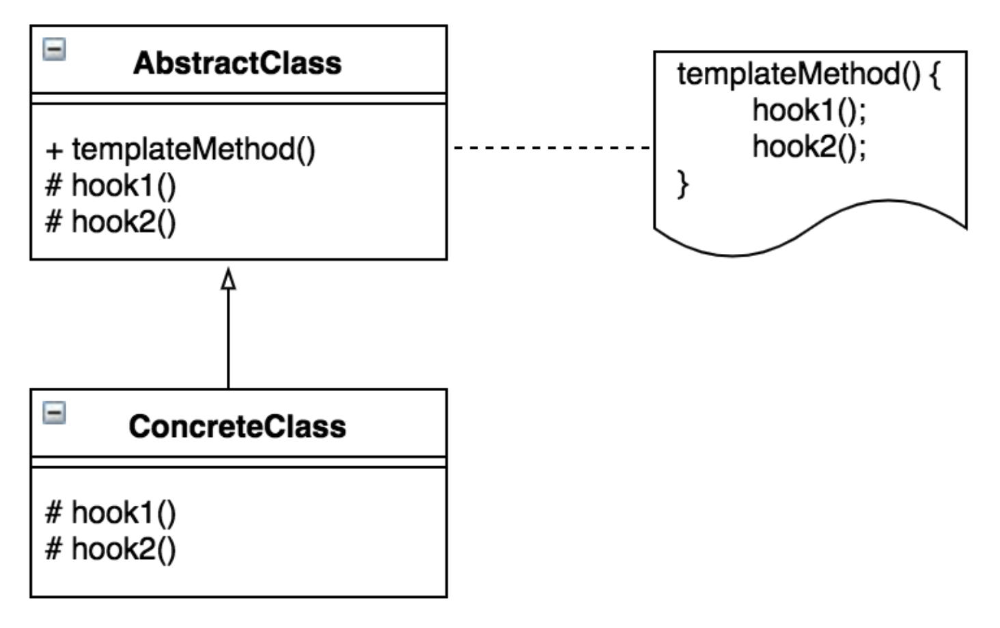
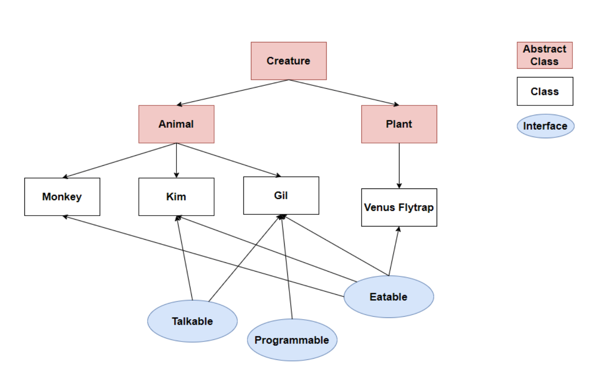

# 템플릿 메서드 디자인 패턴

1. 알고리즘의 구조를 메소드에 정의하고, 하위 클래스에서 알고리즘 구조의 변경없이 알고리즘을 재정의 하는 패턴. 알고리즘이 단계별로 나누어 지거나, 같은 역할을 하는 메소드이지만 여러곳에서 다른형태로 사용이 필요한 경우 유용한 패턴
2. 상속을 통해 슈퍼클래스의 기능을 확장할 때 사용하는 가장 대표적인 방법
변하지 않는 기능은 슈퍼클래스에 만들어두고 자주 변경되며 확장할 기능은 서브클래스에서 만들도록 한다

- template method : 추상 메서드 또는 구현 된 메서드를 활용하여 시나리오를 정의하는 메서드. 하위 클래스에서 재정의 할 수 없도록 final로 선언.
- hook method : 구현부가 비어있는 메서드를 템플릿 메서드에 포함하여
해당 메서드를 필요로 하는 하위 클래스만 구현하여 선택적인 수행을 가능하게 하는 메서드

---

## 템플릿 메서드 패턴에 interface 사용 불가능?

JAVA 8 이후부터 interface의 default method가 지원되기 때문에 메서드의 구현부를 정의할 수 있다. 그런데도 꼭 abstract class를 사용해야 하나?

먼저, 아래와 같이 abstract class와 interface를 비교해본다. 

### abstract class, abstract method

- abstract class
    
    abstract 키워드와 함께 선언된 class. 추상 메서드를 포함할 수도 있고 안할 수 도 있음. 인스턴스화 할 수 없음. 
    
    그러나 상속을 통해, 하위 클래스에서 추상 클래스의 추상 메서드들을 구현할 수 있음. 하나라도 덜 구현 했을 시, 해당 하위 클래스도 abstract class.
    
- abstract method
    
    선언부만 존재하는 메서드(구현부가 없는 메서드)
    

### interface

- 변수
    
    interface의 모든 변수는 상수로 선언됨.(public static final 키워드로 선언하지 않아도 컴파일러가 자동으로 붙여줌) 
    
- 메서드
    
    interface의 모든 메서드는 추상 메서드로 선언됨. (public abstract)
    
    (JAVA 8 이후 부터는 default, static method도 지원)
    
    - default method
        
        구현부를 가지는 메서드. interface를 구현하는 클래스에서 모두 사용 및 재정의 가능.
        
    - static method
        
        인터페이스의 이름으로만 사용 가능한 메서드. interface를 구현하는 클래스에서 재정의 불가능(참조 변수로 호출 시, 에러 발생)
        
    - private method
        
        interface 내부에서만 사용하기 위해 private 키워드를 붙여주어 선언한 메서드. static, non-static 둘 다 가능. interface를 구현하는 클래스에서 사용 및 재정의 불가능.
        

### abstract class vs. interface (JAVA 8 이후 기준)

- 둘 다, 인스턴스화가 불가능하며 구현부가 있고, 없는 메서드 둘 다 선언 가능
- 필드
    
    interface의 필드는 public static final(상수)만 가능하지만, abstract class에서는 static 이나 final이 아닌 필드 선언 가능
    
- 메서드
    
    interface의 메서드는 기본적으로 public 접근 제한자를 가짐. (public or public abstract 키워드와 함께 선언 시, 불필요한 접근자라는 경고 메시지 발생) default or static method에만 private 키워드 사용 가능.
    
    반면에, abstract class는 public 이외에도 protected, private 모두 사용 가능
    
- interface를 구현하는 특정 클래스는 여러 개의 interface를 모두 구현할 수 있음. 그러나, 추상 클래스는 상속을 통해 추상 메서드를 구현하며 자바는 다중 상속을 지원하지 않음.

### 결론

템플릿 메서드 내의 메서드들에 대한 외부 호출을 막기 위해서는 public 이외의 접근 제한자를 사용할 수 있는 abstract class를 사용해야한다. 

---

## 적절한 사용 케이스

### abstract class

- super class의 기능을 이용, 확장 해야할 때(상속에 초점)
    - interface가 구현을 위한 것이라면, abstract class는 상속만을 위한 클래스 이다.
- 서로 관련성 높은 클래스 간에 코드를 공유하고 싶은 경우
- public  이외의 접근 제어자를 사용해야할 경우(외부 호출을 막아야 하는 메서드 존재하는 경우)
    - interface에 public 접근 제한자가 기본적으로 제공되는 이유는, interface의 사용 목적(interface를 구현하는 클래스들에 대해 동일한 동작을 강제하기 위해)을 생각하면 이해할 수 있다.

### interface

- 각각 다른 class를 상속받고 있는 하위 클래스들(서로 관련성이 적은 클래스들)에 공통적인 기능을 구현해야 할 경우
    - 상속 관계가 다름에도 동일한 기능을 구현하도록 강제할 수 있음
    - 각각 다른 abstract class를 상속하는 class들의 공통 기능을 명시할 때 사용하면 편리
    
    
    
- 다중 구현이 필요한 경우 (JAVA는 다중 상속을 지원하지 않기 때문)

---

## Reference

[디자인패턴 - 템플릿 메소드 패턴](https://yaboong.github.io/design-pattern/2018/09/27/template-method-pattern/)

[[Java] Interface vs Abstract Class 정리](https://velog.io/@gillog/Java-Interface-vs-Abstract-Class-%EC%A0%95%EB%A6%AC)